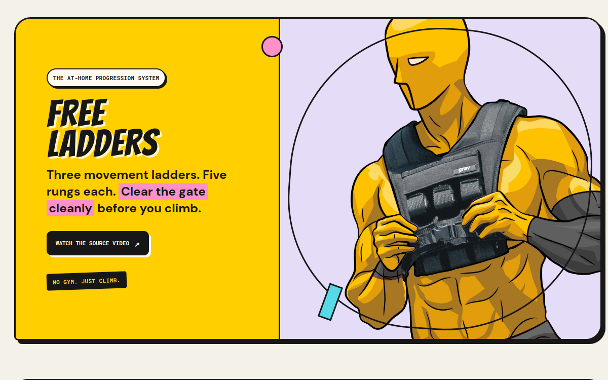

<p align="center">
  <a href="https://elderly-coder.github.io/workout-routine/">
    
  </a>
</p>

<h1 align="center">Workout Routine</h1>

<p align="center">
  My daily at-home progression system: three movement ladders, five rungs each.
</p>

<p align="center">
  <a href="https://elderly-coder.github.io/workout-routine/">
    
  </a>
  
</p>

## Live

**https://elderly-coder.github.io/workout-routine/**

## What it is

An interactive page for the Free Ladders routine: push, pull, and squat ladders with flat-cartoon exercise demos, warm-up and cool-down video links, and the progression rules. No gym, just climb.

## Run it locally

It is one self-contained HTML file. Open `index.html` in any browser, or serve the folder:

```bash
python -m http.server 8000
```
